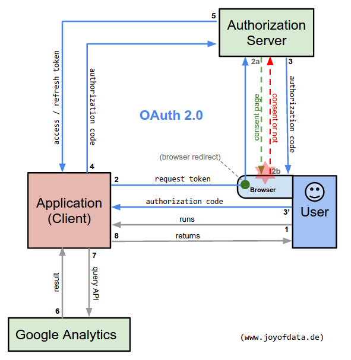

[console.py](console.py) illustrates how to implement OAuth 2.0 authorization for Google APIs - specifically featuring Google Analytics.

Further details and documentation you may find in my article:

[OAuth 2.0 for Google (Analytics) API with Python Explained](http://www.joyofdata.de/blog/oauth2-google-api-python-google-analytics/)

